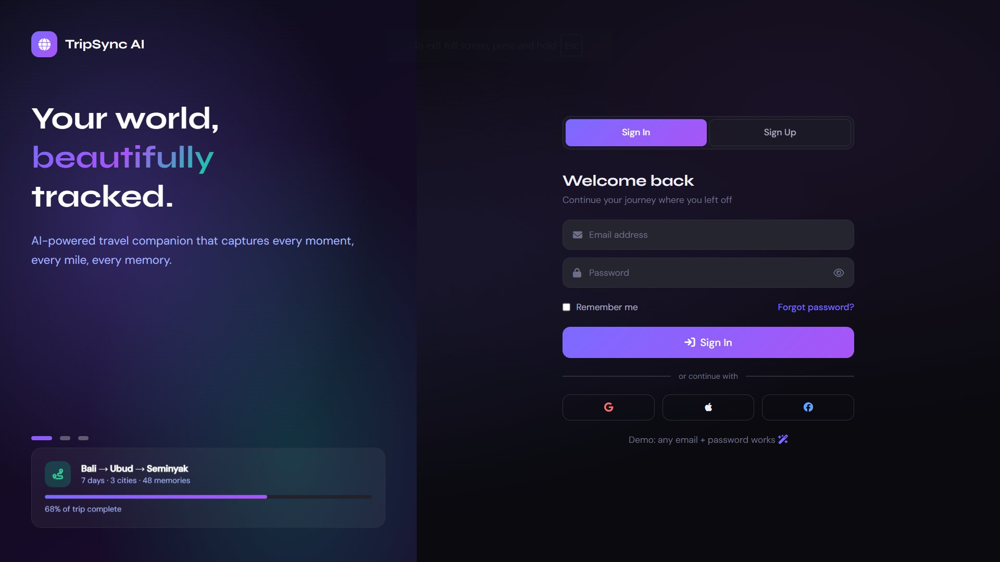
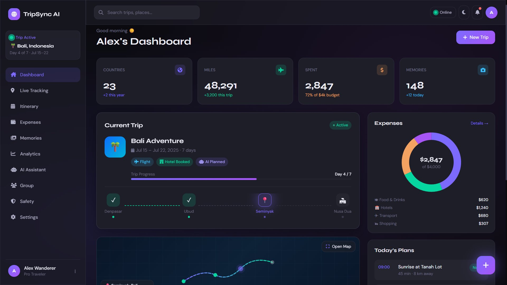
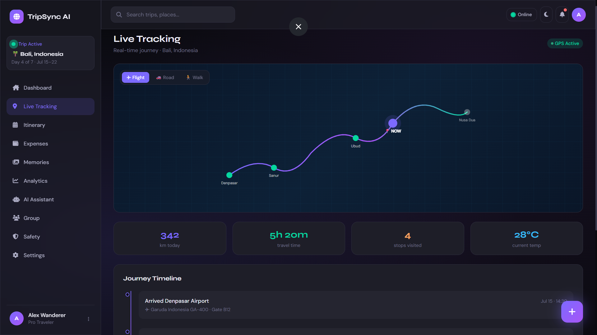
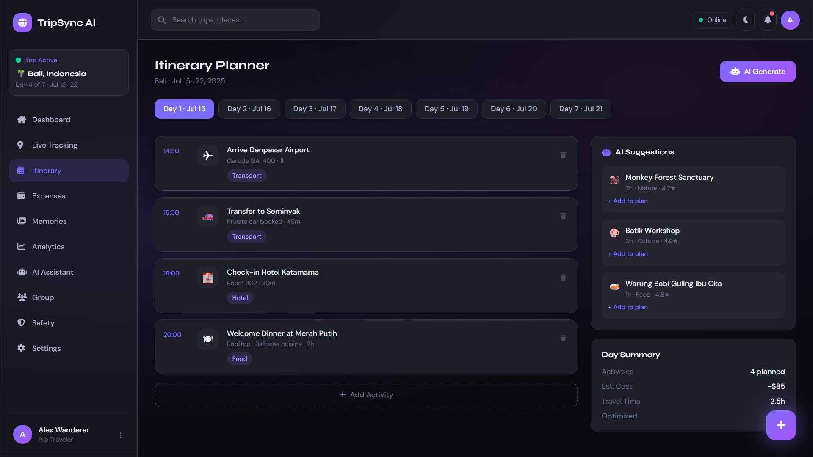
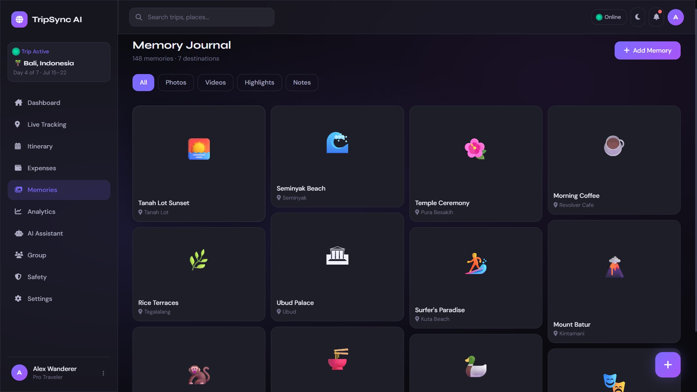
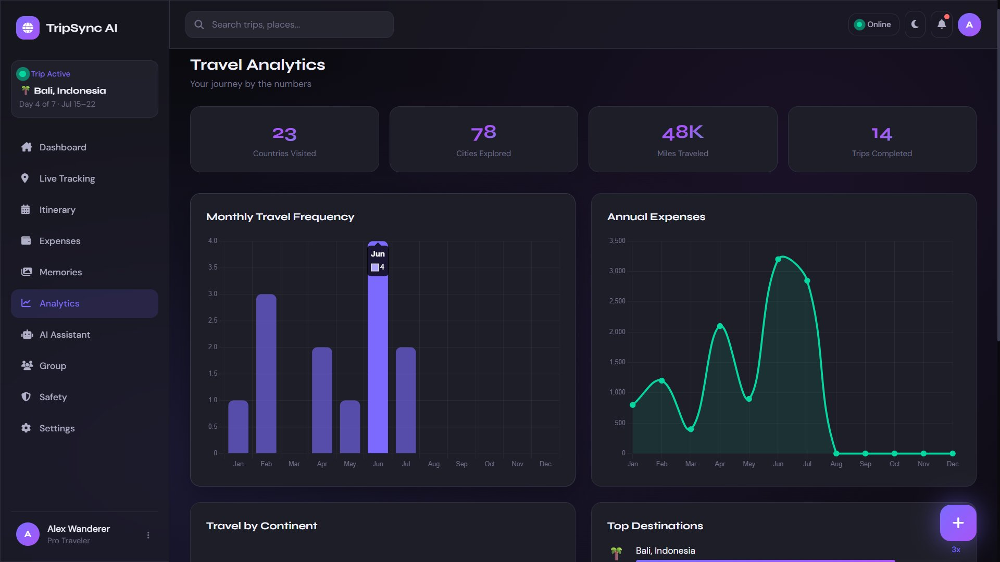
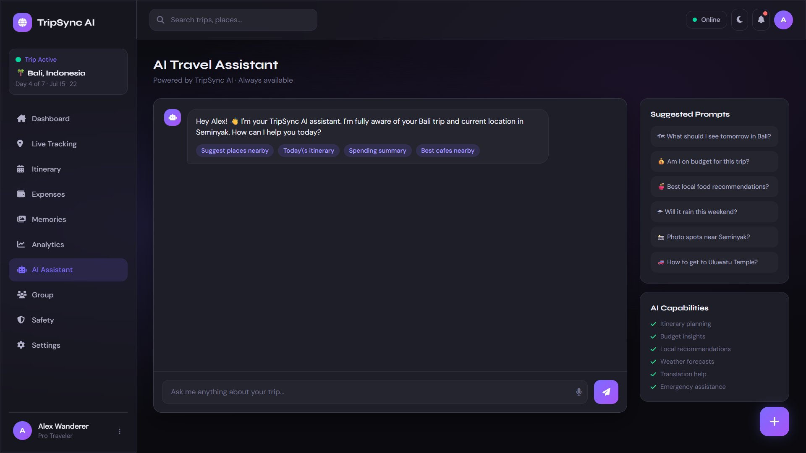
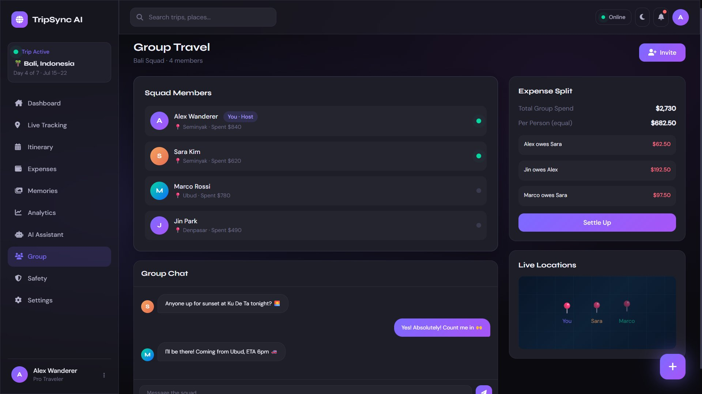
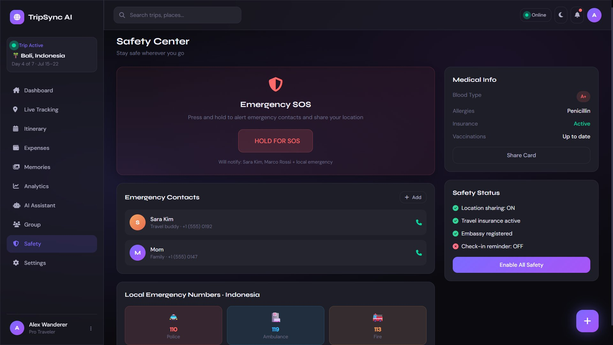
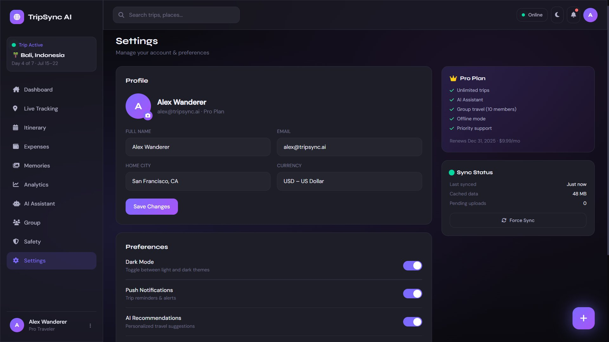

<div align="center">


</div>

<br/>

<div align="center">

<!-- Tech Badges Row 1 -->
[](https://developer.mozilla.org/en-US/docs/Web/HTML)&nbsp;
[](https://tailwindcss.com)&nbsp;
[](https://developer.mozilla.org/en-US/docs/Web/JavaScript)&nbsp;
[](https://www.chartjs.org)&nbsp;
[](https://fontawesome.com)

<br/>

<!-- Info Badges Row 2 -->
&nbsp;
&nbsp;
&nbsp;
&nbsp;
&nbsp;


</div>

<br/>

<div align="center">

### 🌍 &nbsp;Your world, **beautifully** tracked.

*An AI-powered travel companion — fully functional, production-ready,*
*built inside **one single `index.html`** file. No frameworks. No build tools. No backend.*

<br/>

| 🌍 Countries | ✈️ Miles | 📸 Memories | 📦 Modules | ⚡ Dependencies |
|:-----------:|:--------:|:-----------:|:---------:|:--------------:|
| **23** | **48K** | **148** | **11** | **0** |

</div>

<br/>

---

## 📸 &nbsp;Screenshots

> All image filenames match the **exact HTML element `id`** from `index.html`

<br/>

### 🔐 &nbsp;`id="auth-screen"` &nbsp;—&nbsp; Login & Sign Up



<details>
<summary>📋 &nbsp;<b>What's on this screen</b></summary>
<br/>

- ✅ Split-panel layout — animated branding left, auth form right
- ✅ `switchAuth('login' | 'signup')` tab switching
- ✅ Social login buttons — Google / Apple / Facebook → all call `doLogin()`
- ✅ Password visibility toggle — `togglePass('login-pass')`
- ✅ Forgot password modal — `showForgot()` → `#modal-forgot`
- ✅ Onboarding preview card with live progress bar at bottom-left
- ✅ Any email + any password instantly logs in (demo mode)

</details>

---

### 🏠 &nbsp;`id="section-dashboard"` &nbsp;—&nbsp; Command Center



<details>
<summary>📋 &nbsp;<b>What's on this screen</b></summary>
<br/>

- ✅ 4 animated stat cards — countries (23), miles (48,291), spent ($2,847), memories (148) via `.counter[data-target]`
- ✅ Current trip card — Bali Adventure, Day 4/7, progress bar, city checkpoints
- ✅ Interactive SVG map preview → `showSection('tracking')` on click
- ✅ Weather card — Seminyak 28°C with 3-day forecast
- ✅ AI Recommendations widget → `showSection('assistant')`
- ✅ Expense donut chart via `initDashboardCharts()` → `#dashExpenseChart`
- ✅ Today's Plans — 3 scheduled items with time & status badges
- ✅ Recent Memories 3×2 grid → `showSection('memories')`
- ✅ New Trip button → `openNewTrip()` → `#modal-trip`

</details>

---

### 📍 &nbsp;`id="section-tracking"` &nbsp;—&nbsp; Live GPS Journey



<details>
<summary>📋 &nbsp;<b>What's on this screen</b></summary>
<br/>

- ✅ Full-width animated SVG map with gradient route (violet → teal)
- ✅ Travel mode switcher — ✈ Flight / 🚗 Road / 🚶 Walk
- ✅ Pulsing current-location marker with `animate-pulse-soft` ring
- ✅ City dots — Denpasar → Sanur → Ubud → 📍NOW (Seminyak) → Nusa Dua
- ✅ Stats row — 342 km · 5h 20m · 4 stops · 28°C
- ✅ Scrollable journey timeline with 5 events (past ✓, active 📍, upcoming 🔮)
- ✅ GPS Active badge with green pulse dot

</details>

---

### 📅 &nbsp;`id="section-itinerary"` &nbsp;—&nbsp; Day-by-Day Planner



<details>
<summary>📋 &nbsp;<b>What's on this screen</b></summary>
<br/>

- ✅ 7 day-tab buttons — `switchDay(n)` re-renders `ITINERARY[n]` object
- ✅ Activity cards — time, emoji, title, note, duration, category badge, trash button
- ✅ `draggable="true"` drag-and-drop support on all cards
- ✅ `addActivity()` — appends blank card to current day
- ✅ AI Suggestions panel — 3 recommendations with "+ Add to plan" → `addSuggestion()`
- ✅ AI Generate button → `generateAIItinerary()` with loading toast
- ✅ Day Summary sidebar — activity count, est. cost, travel time, optimized flag

</details>

---

### 💰 &nbsp;`id="section-expenses"` &nbsp;—&nbsp; Budget Tracker


<details>
<summary>📋 &nbsp;<b>What's on this screen</b></summary>
<br/>

- ✅ Budget overview — $4,000 total / $2,847 spent / $1,153 remaining
- ✅ Gradient multi-color progress bar (green → amber → red)
- ✅ Category breakdown — Food ($620) · Hotels ($1,240) · Transport ($680) · Shopping ($307)
- ✅ Each category has a unique gradient progress bar
- ✅ Chart.js doughnut `#expensePieChart` via `initExpenseChart()`
- ✅ Transaction list — `renderTransactions()` merges `TRANSACTIONS[]` + `state.expenses`
- ✅ Add Expense modal — `openAddExpense()` → `#modal-expense` → `saveExpense()` → `localStorage`
- ✅ Filter dropdown — `filterExpenses(cat)` on category select

</details>

---

### 📸 &nbsp;`id="section-memories"` &nbsp;—&nbsp; Memory Journal



<details>
<summary>📋 &nbsp;<b>What's on this screen</b></summary>
<br/>

- ✅ CSS masonry layout — `columns: 2` mobile / `3` sm / `4` lg
- ✅ 12 memory cards rendered by `renderMemories()` from `MEMORIES[]` array
- ✅ Each card has emoji, gradient background, title, location pin
- ✅ Variable heights (`h-36` / `h-40` / `h-44` / `h-48` / `h-52`) for masonry effect
- ✅ Filter tabs — All / Photos / Videos / Highlights / Notes
- ✅ Add Memory button → `showToast('📸 Upload feature coming soon!')`
- ✅ Staggered `animate-fadeUp` with per-card `animation-delay`

</details>

---

### 📊 &nbsp;`id="section-analytics"` &nbsp;—&nbsp; Travel Analytics



<details>
<summary>📋 &nbsp;<b>What's on this screen</b></summary>
<br/>

- ✅ 4 stat cards — 23 countries, 78 cities, 48K miles, 14 trips (all with `.grad-text`)
- ✅ `#monthlyChart` — Chart.js bar chart, monthly travel frequency Jan–Dec
- ✅ `#annualChart` — Chart.js line chart with fill, annual expenses trend
- ✅ `#continentChart` — Chart.js polar area, Asia / Europe / Americas / Oceania / Africa
- ✅ All charts init via `initAnalyticsCharts()` with `destroyChart()` guard against re-init
- ✅ Top Destinations — Bali 80% / Tokyo 60% / Patagonia 40% / Santorini 55%

</details>

---

### 🤖 &nbsp;`id="section-assistant"` &nbsp;—&nbsp; AI Travel Chat



<details>
<summary>📋 &nbsp;<b>What's on this screen</b></summary>
<br/>

- ✅ Chat container — `#chat-messages` with `appendUserMsg()` + `appendAIMsg()`
- ✅ Typing animation — `appendTyping()` inserts `#typing-indicator` with 3 `.typing-dot` elements
- ✅ `getAIResponse(msg)` — keyword matches 4 queries in `AI_RESPONSES{}` object
- ✅ Quick-prompt badge buttons in welcome message → `sendQuick(msg)`
- ✅ `Enter` key on `#chat-input` triggers `sendChat()`
- ✅ 6 suggested prompt buttons in sidebar (also call `sendQuick()`)
- ✅ AI Capabilities checklist — 6 items
- ✅ Voice button UI → `showToast('🎙 Voice input coming soon!')`

</details>

---

### 👥 &nbsp;`id="section-group"` &nbsp;—&nbsp; Group Travel



<details>
<summary>📋 &nbsp;<b>What's on this screen</b></summary>
<br/>

- ✅ 4 squad members — Alex (Host), Sara, Marco, Jin with gradient avatars
- ✅ Online dot (green pulse) for Alex + Sara; offline (grey) for Marco + Jin
- ✅ Group chat — `sendGroupChat()` appends user bubble, then random auto-reply after 800ms
- ✅ Auto-replies from random member (S / M / J) with random message from `replies[]`
- ✅ Expense split — $2,730 ÷ 4 = $682.50 per person
- ✅ Settle Up → `showToast('💸 Settlement requests sent!')`
- ✅ Live map mini-view with 3 floating 📍 pins (animate-float with staggered delays)

</details>

---

### 🛡️ &nbsp;`id="section-safety"` &nbsp;—&nbsp; Safety Center



<details>
<summary>📋 &nbsp;<b>What's on this screen</b></summary>
<br/>

- ✅ Emergency SOS card — `triggerSOS()` fires 3 sequential toasts (1s apart)
  - Toast 1: `🚨 SOS Alert sent to Sara & Marco!`
  - Toast 2: `📍 Live location shared with emergency contacts`
  - Toast 3: `🚔 Local emergency services notified`
- ✅ Emergency contacts — Sara Kim + Mom with `showToast('📞 Calling...')` on phone icon
- ✅ Local numbers — 🚔 110 Police / 🏥 119 Ambulance / 🚒 113 Fire
- ✅ Medical card — Blood Type A+ / Allergies: Penicillin / Insurance: Active
- ✅ Safety status — 3 green checks + 1 red X (check-in reminder off)
- ✅ Enable All Safety button → `showToast('✅ Check-in reminder enabled!')`

</details>

---

### ⚙️ &nbsp;`id="section-settings"` &nbsp;—&nbsp; Settings



<details>
<summary>📋 &nbsp;<b>What's on this screen</b></summary>
<br/>

- ✅ Profile section — avatar, name, email, city, currency form fields
- ✅ Save Changes → `showToast('✅ Profile saved!')`
- ✅ Dark Mode toggle → `toggleTheme()` — updates `data-theme` on `<html>` + `localStorage`
- ✅ Push Notifications, AI Recommendations, Offline Mode toggles
- ✅ Export — Trip Report (PDF) / Analytics (Excel) / Photos / Delete Account
- ✅ Pro Plan sidebar card — 5 feature checkmarks + renewal info
- ✅ Sync Status card — last synced, cached data (48 MB), pending uploads (0)
- ✅ Force Sync → `showToast('🔄 Sync complete!')`

</details>

---

## 🚀 &nbsp;Quick Start

```bash
# ① Just open the file — zero setup required
open index.html

# ② Python local server
python3 -m http.server 8080

# ③ Node.js serve
npx serve .

# ④ VS Code — right-click index.html → "Open with Live Server"
```

**Demo login — any values work:**

```
Email    →  alex@tripsync.ai   (or anything)
Password →  anything           (no validation)
```

> `doLogin()` hides `#auth-screen` → shows `#app-shell` → `showSection('dashboard')` → `initApp()`

---

## 📦 &nbsp;File & Folder Structure

```
TripSync-AI/
│
├── 📄 index.html                     ← Entire app — HTML + CSS + JS in one file
│
└── 📁 screenshots/                   ← Named by exact HTML element id
    ├── 🖼 auth-screen.png            ←  id="auth-screen"
    ├── 🖼 section-dashboard.png      ←  id="section-dashboard"
    ├── 🖼 section-tracking.png       ←  id="section-tracking"
    ├── 🖼 section-itinerary.png      ←  id="section-itinerary"
    ├── 🖼 section-expenses.png       ←  id="section-expenses"
    ├── 🖼 section-memories.png       ←  id="section-memories"
    ├── 🖼 section-analytics.png      ←  id="section-analytics"
    ├── 🖼 section-assistant.png      ←  id="section-assistant"
    ├── 🖼 section-group.png          ←  id="section-group"
    ├── 🖼 section-safety.png         ←  id="section-safety"
    └── 🖼 section-settings.png       ←  id="section-settings"
```

---

## 🗂️ &nbsp;Module Map

| Screenshot | `id` in HTML | `showSection()` call | Sidebar Label | Bottom Nav |
|:-----------|:-------------|:---------------------|:--------------|:-----------|
| `auth-screen.png` | `auth-screen` | hidden by `doLogin()` | — | — |
| `section-dashboard.png` | `section-dashboard` | `showSection('dashboard')` | Dashboard | 🏠 Home |
| `section-tracking.png` | `section-tracking` | `showSection('tracking')` | Live Tracking | 📍 Track |
| `section-itinerary.png` | `section-itinerary` | `showSection('itinerary')` | Itinerary | 📅 Plan |
| `section-expenses.png` | `section-expenses` | `showSection('expenses')` | Expenses | 💰 Budget |
| `section-memories.png` | `section-memories` | `showSection('memories')` | Memories | — |
| `section-analytics.png` | `section-analytics` | `showSection('analytics')` | Analytics | — |
| `section-assistant.png` | `section-assistant` | `showSection('assistant')` | AI Assistant | 🤖 AI |
| `section-group.png` | `section-group` | `showSection('group')` | Group | — |
| `section-safety.png` | `section-safety` | `showSection('safety')` | Safety | — |
| `section-settings.png` | `section-settings` | `showSection('settings')` | Settings | — |

---

## ✨ &nbsp;Feature Highlights

<table>
<tr>
<td valign="top" width="50%">

**🏠 Dashboard**
- Animated counters with cubic ease (`animateCounters()`)
- Live trip status + city checkpoint bar
- Chart.js donut (`initDashboardCharts()`)
- Real-time memory counter update every 8s

**📍 Tracking**
- SVG gradient route path
- Pulsing live location marker
- Journey timeline (5 events)
- Travel mode switcher

**📅 Itinerary**
- 7-day tabs (`switchDay(n)`)
- Drag-and-drop cards (`draggable`)
- AI Generate + AI Suggestions
- Per-day data from `ITINERARY{}` object

**💰 Expenses**
- Add/delete with `localStorage` persistence
- Chart.js doughnut breakdown
- Category progress bars
- Merged mock + user transactions

</td>
<td valign="top" width="50%">

**🤖 AI Assistant**
- Typing animation (3 dots)
- `getAIResponse()` keyword matcher
- 4 built-in smart responses
- Quick-prompt shortcuts

**👥 Group**
- Squad live status dots
- Auto-reply group chat simulation
- Expense split calculator
- Settle Up flow

**📊 Analytics**
- 3 Chart.js graphs (bar / line / polar)
- `destroyChart()` prevents re-init bugs
- Animated stat counters
- Top destinations ranking

**🛡 Safety + ⚙ Settings**
- Multi-step SOS alert (`triggerSOS()`)
- Full profile form
- Dark/Light theme (`toggleTheme()`)
- Data export with toast feedback

</td>
</tr>
</table>

---

## 🛠️ &nbsp;Tech Stack

| Technology | Source | Role |
|:-----------|:-------|:-----|
| **HTML5** | Native | Structure, all `id` anchors, modals |
| **TailwindCSS** | CDN `cdn.tailwindcss.com` | Utility classes, responsive grid |
| **Vanilla JS ES6+** | Native | State, routing, events, DOM |
| **Chart.js** | CDN `cdn.jsdelivr.net` | Doughnut, bar, line, polar charts |
| **Font Awesome 6.5** | CDN `cdnjs.cloudflare.com` | All icons |
| **Google Fonts** | CDN `fonts.googleapis.com` | Syne (headings) + DM Sans (body) |
| **LocalStorage** | Native | `theme` + `expenses` persistence |
| **IntersectionObserver** | Native | Scroll-reveal on `.card` elements |
| **CSS Custom Properties** | Native | Full dual-theme system via `:root` |
| **SVG** | Native | Map route paths + location markers |

---

## 🎨 &nbsp;Design Tokens

```css
/* ── DARK THEME (default) ── */
:root {
  --bg:       #0a0a0f;   /* Deep space background     */
  --surface:  #1e1e28;   /* Card / panel surfaces     */
  --surface2: #252530;   /* Input backgrounds         */
  --border:   #2e2e3e;   /* Default borders           */
  --text:     #f0f0fa;   /* Primary text              */
  --text2:    #b0b0c8;   /* Secondary text            */
  --text3:    #6e6e88;   /* Placeholder / labels      */

  /* Brand palette */
  --accent:   #7c6aff;   /* Primary violet            */
  --accent2:  #a855f7;   /* Secondary purple          */
  --accent3:  #06d6a0;   /* Emerald / online / success*/
  --gold:     #f4a261;   /* Amber / warnings          */
  --rose:     #ff6b6b;   /* Error / danger / SOS      */
  --sky:      #38bdf8;   /* Info / weather            */
}

/* ── LIGHT THEME ── */
[data-theme="light"] {
  --bg:       #f5f5fa;
  --surface:  #ffffff;
  --text:     #0a0a1e;
  /* ...all tokens inverted */
}
```

---

## ⌨️ &nbsp;Keyboard Shortcuts

| Keys | Action | JS Handler |
|:-----|:-------|:-----------|
| `Ctrl` + `K` | Focus global search | `#global-search.focus()` |
| `Escape` | Close all modals | Loops `.modal-backdrop` → `display:none` |
| `Enter` in `#chat-input` | Send AI message | `sendChat()` |
| `Enter` in `#group-chat-input` | Send group message | `sendGroupChat()` |

---

## 💾 &nbsp;LocalStorage Keys

```js
// Persisted automatically across sessions
localStorage.getItem('theme')     // → "dark" | "light"
localStorage.getItem('expenses')  // → JSON.stringify(state.expenses[])

// Read on app init
state.theme    = localStorage.getItem('theme') || 'dark'
state.expenses = JSON.parse(localStorage.getItem('expenses') || '[]')
```

---

## 🎭 &nbsp;CSS Animation Reference

| Keyframe | Applied To | Effect |
|:---------|:-----------|:-------|
| `fadeUp` | Section reveal, cards | Slide up + fade in on enter |
| `fadeIn` | Modal backdrop, toasts | Opacity 0 → 1 |
| `slideLeft` | Toast notifications | Slide in from right |
| `float` | Cards, map 📍 pins | Gentle vertical bob |
| `pulse` | Typing dots | Opacity 1 → 0.5 loop |
| `ping` | Online dot ring | Scale 1 → 2, fade out |
| `glow` | FAB button | Box-shadow pulse |
| `shimmer` | Skeleton loaders | Background sweep |
| `pathDraw` | SVG route | `stroke-dashoffset` 1000 → 0 |
| `spin` | Loading states | 360° rotation |

---

## 📄 &nbsp;License

```
MIT License — © 2025 TripSync AI
Free to use, modify, and distribute with attribution.
```

---

<div align="center">

<br/>

**Made with ❤️ and zero build tools**

`HTML5` &nbsp;·&nbsp; `TailwindCSS` &nbsp;·&nbsp; `Chart.js` &nbsp;·&nbsp; `Font Awesome` &nbsp;·&nbsp; `Vanilla JS`

<br/>

⭐ &nbsp;**If this helped you, please star the repo!**&nbsp; ⭐

<br/>


</div>
