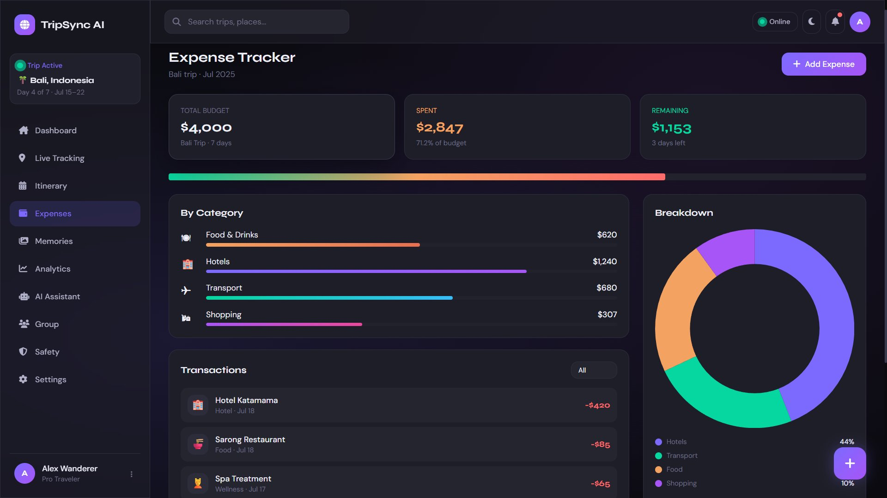

<div align="center">


<br/>

[](https://developer.mozilla.org/en-US/docs/Web/HTML)
[](https://tailwindcss.com)
[](https://developer.mozilla.org/en-US/docs/Web/JavaScript)
[](https://www.chartjs.org)
[](https://fontawesome.com)

<br/>

[](.)
[](.)
[](.)
[](.)
[](.)
[](.)

<br/>

> **AI-powered travel companion built in ONE single `index.html` file** — no frameworks, no build tools, no backend.  
> Captures every moment, every mile, every memory. ✈️🌍

<br/>

```
🌍  23 Countries  ·  ✈️  48K Miles  ·  📸  148 Memories  ·  💰  11 Modules  ·  ⚡  0 Dependencies
```

</div>

---

## 🖼️ Screenshots

> **Image filenames match the exact HTML element IDs** used in `index.html` —  
> `auth-screen.png` for the login page, and `section-{id}.png` for every app module.

---

### 🔐 `auth-screen` — Login & Sign Up


> `id="auth-screen"` · Glassmorphism split-screen auth with animated onboarding card, social login buttons (Google / Apple / Facebook), password visibility toggle, forgot password modal, and remember me checkbox.

---

### 🏠 `section-dashboard` — Command Center


> `id="section-dashboard"` · Animated stat counters, live trip status with city checkpoints, SVG map preview, weather card, AI recommendations, expense donut chart (Chart.js), today's schedule, and recent memory grid.

---

### 📍 `section-tracking` — Live GPS Journey


> `id="section-tracking"` · Animated SVG route path with gradient stroke, travel mode switcher (✈ Flight / 🚗 Road / 🚶 Walk), pulsing current-location marker, 4-stat row (342km · 5h 20m · 4 stops · 28°C), and scrollable journey timeline.

---

### 📅 `section-itinerary` — Day-by-Day Planner


> `id="section-itinerary"` · 7-day tab switcher (`switchDay(n)`), draggable activity cards rendered from `ITINERARY[n]` data, AI Suggestions panel with one-click add (`addSuggestion()`), Add Activity button, and Day Summary widget.

---

### 💰 `section-expenses` — Budget Tracker



> `id="section-expenses"` · Budget overview ($4,000 / $2,847 / $1,153), gradient multi-color progress bar, category breakdown bars, Chart.js doughnut (`initExpenseChart()`), transaction list (`renderTransactions()`), and Add Expense modal persisted via `localStorage`.

---

### 📸 `section-memories` — Memory Journal


> `id="section-memories"` · CSS masonry gallery (`columns: 2/3/4`) with 12 location-tagged memory cards rendered by `renderMemories()`, category filter tabs (All / Photos / Videos / Highlights / Notes), and gradient emoji placeholder visuals.

---

### 📊 `section-analytics` — Travel Analytics


> `id="section-analytics"` · 4 animated stat cards with `.counter` class, Chart.js bar chart (`monthlyChart`), line chart (`annualChart`), polar area chart (`continentChart`), all initialized by `initAnalyticsCharts()`, plus top destinations with progress bars.

---

### 🤖 `section-assistant` — AI Travel Chat


> `id="section-assistant"` · Full chat UI with `appendUserMsg()`, `appendTyping()`, `appendAIMsg()`, 3-dot typing animation, `getAIResponse()` keyword matcher, `sendQuick()` prompt shortcuts, suggested prompts sidebar, and AI capabilities list.

---

### 👥 `section-group` — Group Travel


> `id="section-group"` · Squad member list with online dot pulse, `sendGroupChat()` with random auto-reply simulation, expense split calculator ($2,730 ÷ 4 = $682.50), Settle Up button, and live SVG map with floating 📍 pins.

---

### 🛡️ `section-safety` — Safety Center


> `id="section-safety"` · `triggerSOS()` fires 3 sequential toasts (contacts → location → emergency services), emergency contacts with call action, local numbers (🚔 110 / 🏥 119 / 🚒 113), medical info card (blood type, allergies, insurance), and safety status checklist.

---

### ⚙️ `section-settings` — Settings


> `id="section-settings"` · Profile form (name, email, city, currency), `toggleTheme()` dark/light switch, push notifications, AI recommendations, offline mode, data export buttons (`showToast` feedback), Pro Plan card, and `Force Sync` button.

---

## 📦 Project Structure

```
TripSync-AI/
│
├── index.html                      ← Entire application (single file)
│
└── screenshots/                    ← Named by HTML element ID from index.html
    ├── auth-screen.png             ← id="auth-screen"
    ├── section-dashboard.png       ← id="section-dashboard"  showSection('dashboard')
    ├── section-tracking.png        ← id="section-tracking"   showSection('tracking')
    ├── section-itinerary.png       ← id="section-itinerary"  showSection('itinerary')
    ├── section-expenses.png        ← id="section-expenses"   showSection('expenses')
    ├── section-memories.png        ← id="section-memories"   showSection('memories')
    ├── section-analytics.png       ← id="section-analytics"  showSection('analytics')
    ├── section-assistant.png       ← id="section-assistant"  showSection('assistant')
    ├── section-group.png           ← id="section-group"      showSection('group')
    ├── section-safety.png          ← id="section-safety"     showSection('safety')
    └── section-settings.png        ← id="section-settings"   showSection('settings')
```

---

## 🗂️ Section ID → Module Reference

| Screenshot File | HTML `id` | JS Call | Sidebar Label | Bottom Nav |
|----------------|-----------|---------|--------------|-----------|
| `auth-screen.png` | `auth-screen` | `doLogin()` hides it | — | — |
| `section-dashboard.png` | `section-dashboard` | `showSection('dashboard')` | Dashboard | Home |
| `section-tracking.png` | `section-tracking` | `showSection('tracking')` | Live Tracking | Track |
| `section-itinerary.png` | `section-itinerary` | `showSection('itinerary')` | Itinerary | Plan |
| `section-expenses.png` | `section-expenses` | `showSection('expenses')` | Expenses | Budget |
| `section-memories.png` | `section-memories` | `showSection('memories')` | Memories | — |
| `section-analytics.png` | `section-analytics` | `showSection('analytics')` | Analytics | — |
| `section-assistant.png` | `section-assistant` | `showSection('assistant')` | AI Assistant | AI |
| `section-group.png` | `section-group` | `showSection('group')` | Group | — |
| `section-safety.png` | `section-safety` | `showSection('safety')` | Safety | — |
| `section-settings.png` | `section-settings` | `showSection('settings')` | Settings | — |

---

## ✨ Key Functions Reference

| Function | File Location | What It Does |
|----------|-------------|--------------|
| `doLogin()` | JS block | Hides `auth-screen`, shows `app-shell`, calls `initApp()` |
| `showSection(id)` | JS block | Hides all `.section`, shows `section-{id}`, updates nav active states |
| `toggleTheme()` | JS block | Flips `data-theme` attr on `<html>`, saves to `localStorage` |
| `toggleSidebar()` | JS block | Toggles `.collapsed` / `.mobile-open` on `#sidebar` |
| `showToast(msg, type)` | JS block | Creates toast div in `#toast-container`, auto-removes after 3.5s |
| `initDashboardCharts()` | JS block | Renders Chart.js doughnut in `#dashExpenseChart` |
| `initExpenseChart()` | JS block | Renders Chart.js doughnut in `#expensePieChart` |
| `initAnalyticsCharts()` | JS block | Renders bar/line/polar charts in `#monthlyChart`, `#annualChart`, `#continentChart` |
| `renderItinerary(day)` | JS block | Injects `ITINERARY[day]` cards into `#itinerary-cards` |
| `renderTransactions()` | JS block | Merges `TRANSACTIONS` + `state.expenses` into `#transactions-list` |
| `renderMemories()` | JS block | Injects `MEMORIES` array into `#memories-grid` masonry layout |
| `sendChat()` | JS block | Reads `#chat-input`, calls `appendUserMsg()` + `getAIResponse()` |
| `sendGroupChat()` | JS block | Appends message to `#group-chat`, simulates auto-reply |
| `triggerSOS()` | JS block | Fires 3 sequential `showToast()` calls with 1s delays |
| `animateCounters()` | JS block | Animates `.counter[data-target]` elements with cubic easing |
| `openAddExpense()` | JS block | Shows `#modal-expense`, sets today's date |
| `openNewTrip()` | JS block | Shows `#modal-trip` |
| `openNotifs()` | JS block | Shows `#modal-notifs` |
| `saveExpense()` | JS block | Validates, pushes to `state.expenses`, saves to `localStorage` |
| `toggleOffline()` | JS block | Flips `state.isOffline`, updates `#offline-btn` UI |
| `switchDay(day)` | JS block | Updates `state.currentDay`, re-renders itinerary tabs |
| `getAIResponse(msg)` | JS block | Keyword-matches `AI_RESPONSES` object, returns contextual reply |

---

## 🚀 Quick Start

```bash
# Option 1 — Just open the file (zero setup)
open index.html

# Option 2 — Python server
python3 -m http.server 8080

# Option 3 — Node serve
npx serve .

# Option 4 — VS Code
# Right-click index.html → "Open with Live Server"
```

**Demo credentials — any values work:**
```
Email:    alex@tripsync.ai
Password: anything
```

> `doLogin()` → hides `#auth-screen` → shows `#app-shell` → `showSection('dashboard')` → `initApp()`

---

## 🛠️ Tech Stack

| Technology | CDN | Purpose |
|-----------|-----|---------|
| **HTML5** | Native | Semantic structure & all element IDs |
| **TailwindCSS** | `cdn.tailwindcss.com` | Utility-first responsive styling |
| **Vanilla JS ES6+** | Native | State management, routing, events |
| **Chart.js** | `cdn.jsdelivr.net/npm/chart.js` | Doughnut, bar, line, polar area charts |
| **Font Awesome 6.5** | `cdnjs.cloudflare.com` | 6,000+ icons |
| **Google Fonts** | `fonts.googleapis.com` | Syne (display) + DM Sans (body) |
| **LocalStorage** | Native | `theme` + `expenses` key persistence |
| **IntersectionObserver** | Native | Scroll-reveal `.card` animations |
| **CSS Custom Properties** | Native | Full dual-theme system via `:root` |
| **SVG** | Native | Custom map routes and location markers |

---

## 🎨 CSS Design Tokens

```css
:root {
  --bg:       #0a0a0f;   /* Deep space page background   */
  --surface:  #1e1e28;   /* Card / panel surfaces        */
  --surface2: #252530;   /* Input & nested backgrounds   */
  --border:   #2e2e3e;   /* Default border color         */
  --text:     #f0f0fa;   /* Primary text                 */
  --text2:    #b0b0c8;   /* Secondary / muted text       */
  --text3:    #6e6e88;   /* Placeholder / label text     */
  --accent:   #7c6aff;   /* Primary violet               */
  --accent2:  #a855f7;   /* Secondary purple             */
  --accent3:  #06d6a0;   /* Emerald success / online     */
  --gold:     #f4a261;   /* Amber warning                */
  --rose:     #ff6b6b;   /* Error / danger / SOS         */
  --sky:      #38bdf8;   /* Info / weather / transport   */
}
```

---

## ⌨️ Keyboard Shortcuts

| Key | Trigger | JS Handler |
|-----|---------|-----------|
| `Ctrl + K` | `document keydown` | `document.getElementById('global-search').focus()` |
| `Escape` | `document keydown` | Closes all `.modal-backdrop` elements |
| `Enter` | `#chat-input onkeydown` | `sendChat()` |
| `Enter` | `#group-chat-input onkeydown` | `sendGroupChat()` |

---

## 📄 License

```
MIT License — © 2025 TripSync AI
Free to use, modify, and distribute.
```

---

<div align="center">


**Built with ❤️ using HTML5 · TailwindCSS · Chart.js · Font Awesome · Vanilla JS**

⭐ **Star this repo** if you found it helpful!

`🌍 TripSync AI — Your world, beautifully tracked.`

</div>
